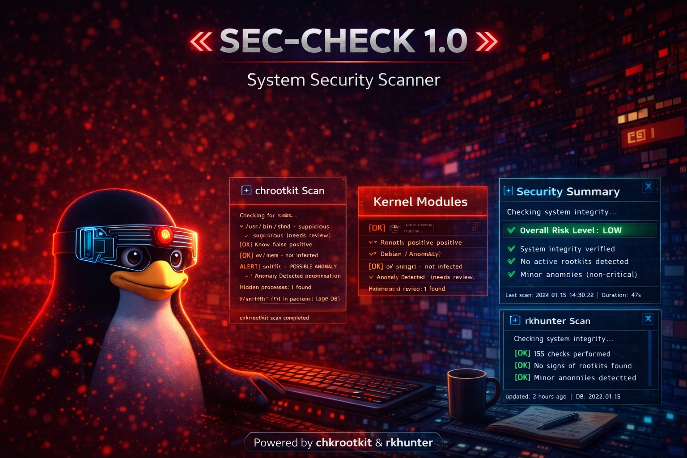

# English

<p align="center">
  
</p>

<h1 align="center">SecCheck – Security & Integrity Check</h1>

<p align="center">
A Bash tool for Arch Linux that helps you read and understand system security signals more clearly.
</p>

<p align="center">
  
  
  
</p>

---

SecCheck is a Bash tool designed for Arch Linux and its derivatives.

It does not introduce new scanning techniques and it does not replace existing tools.  
Instead, it combines real system checks and presents them in a clearer and more readable way.

The goal is simple: help you understand what is happening on your system without getting lost in raw output or generic warnings.

SecCheck uses three core components.  
It relies on rkhunter to detect suspicious patterns, Lynis to perform a system audit, and pacman to verify package integrity.

At the end of a scan, results are summarized and presented with a visual risk indicator.

If something needs attention, SecCheck can optionally run a contextual verification phase.  
This step analyzes files, packages and paths involved, helping distinguish between normal behavior, false positives and potential anomalies.

---

## Output

All output is bilingual.

Messages are shown in English with an Italian translation directly below each line.

---

## Installation

### Clone the repository

```bash
git clone https://github.com/KlodCripta/seccheck.git
cd seccheck
chmod +x seccheck.sh
sudo bash seccheck.sh
```

---

## AUR (coming soon)

SecCheck will be available on AUR.

---

## Usage

sudo bash seccheck.sh

The tool provides a simple menu to run a full scan or individual modules.

At the end of the scan, a report is generated.
If anomalies are detected, you will be prompted to run contextual verification.

---

## Requirements

Arch Linux or Arch-based distribution
rkhunter
lynis

Dependencies are checked automatically.
If missing, SecCheck can install them on request.

---

## Philosophy

SecCheck is not an antivirus.

It does not guarantee that a system is safe and it does not claim to detect every threat.

It is designed to reduce ambiguity and help interpret system signals more clearly.

---

## License

This project is released under the MIT License.

---

## Italiano

<p align="center">
  
</p>

<h1 align="center">SecCheck – Security & Integrity Check</h1>

<p align="center">
A Bash tool for Arch Linux that helps you read and understand system security signals more clearly.
</p>

<p align="center">
  
  
  
</p>

---

SecCheck è un tool scritto in Bash pensato per Arch Linux e derivate.

Non introduce nuovi metodi di scansione e non sostituisce strumenti esistenti.
Mette insieme controlli reali già disponibili nel sistema e li presenta in modo più leggibile.

L’obiettivo è semplice: aiutarti a capire cosa sta succedendo nel sistema senza dover interpretare output grezzi o warning poco chiari.

SecCheck utilizza tre componenti principali.
Usa rkhunter per individuare segnali sospetti, Lynis per eseguire un audit del sistema e pacman per verificare l’integrità dei pacchetti.

Al termine della scansione, i risultati vengono riassunti e mostrati con un indicatore visivo del rischio.

Se vengono rilevati elementi che meritano attenzione, il tool può eseguire una verifica contestuale opzionale.
Questa fase analizza file, pacchetti e percorsi coinvolti, aiutando a distinguere tra comportamenti normali, falsi positivi e possibili anomalie.

---

## Output

L’output è bilingue.

Ogni messaggio viene mostrato in inglese con traduzione italiana subito sotto.

---

## Installazione

Clonare il repository

```bash
git clone https://github.com/KlodCripta/seccheck.git
cd seccheck
chmod +x seccheck.sh
sudo bash seccheck.sh
```

## AUR (in arrivo)

SecCheck sarà disponibile su AUR.

---

## Utilizzo

sudo bash seccheck.sh

Il tool propone un menu semplice per eseguire una scansione completa o singoli moduli.

Al termine viene generato un report.
Se vengono rilevate anomalie, viene proposta la verifica contestuale.

---

## Requisiti
Arch Linux o derivata
rkhunter
lynis

Le dipendenze vengono controllate automaticamente.
Se mancanti, SecCheck può installarle su richiesta.

---

## Filosofia

SecCheck non è un antivirus.

Non garantisce che un sistema sia sicuro e non pretende di rilevare ogni minaccia.

È uno strumento pensato per ridurre l’ambiguità e aiutare a interpretare meglio i segnali del sistema.

---

## Licenza

Questo progetto è rilasciato sotto licenza MIT.
