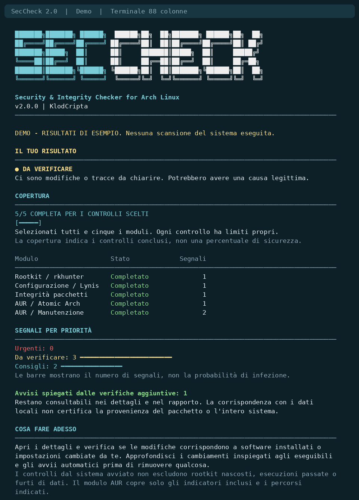

# SecCheck 2.0 — development

A bilingual terminal security assistant for **Arch Linux and its derivatives**.
Petrolio colors, readable findings, explicit coverage and practical next steps.



Actual demo output captured from a terminal; the background belongs to the terminal
theme. SecCheck respects the user's terminal background.

**Development version:** automated tests run on Ubuntu with inert scanner fixtures.
A real Arch/derivative validation pass is still required before release. The existing
poster and 1.x screenshots are historical; the poster will be refreshed separately.

## Start / Avvio

```bash
git clone --branch codex/seccheck-2.0 https://github.com/KlodCripta/seccheck.git
cd seccheck
bash seccheck.sh
```

Choose **1 English** or **2 Italiano** at startup. Root is requested only when
needed; your chosen language and paths are retained through sudo. On Arch and its
derivatives, the interactive startup checks the scanner dependencies, explains
their purpose and offers to install missing packages. You can decline and continue.

Scegli **1 English** o **2 Italiano** all'avvio. I permessi di root vengono richiesti
quando servono; lingua e percorsi scelti vengono mantenuti dopo sudo. Il controllo
iniziale mostra gli strumenti disponibili e quelli mancanti, spiegando a cosa
servono. Puoi accettare l'installazione con pacman oppure proseguire con i controlli
disponibili. Vengono richiesti solo i pacchetti mancanti, senza conferme automatiche.

**1 — Full scan / Scansione completa** includes **2, 3, 4, 5 and 9**. Options 6–8
are separate tools: dependencies, signature updates and the example result.
See the [current terminal menu](screenshots/seccheck-v2-menu.png).

Try the interface anywhere, without root or scanners:

```bash
bash seccheck.sh --lang it --demo review
bash seccheck.sh --lang en --demo urgent
bash seccheck.sh --lang it --demo incomplete --ascii --no-color
bash seccheck.sh --lang en --demo clean
```

## Checks / Controlli

| Module | What it checks / Cosa controlla |
| --- | --- |
| rkhunter | Known rootkit indicators and suspicious properties / Indicatori di rootkit e proprietà sospette |
| Lynis | System configuration and hardening advice / Configurazione e consigli di sicurezza |
| Integrity | pacman metadata **and** paccheck SHA-256 against local package records / Metadati e contenuto dei file rispetto ai dati locali dei pacchetti |
| AUR / Atomic Arch | Static inspection of documented campaign traces / Ricerca statica di tracce documentate della campagna |
| AUR / Project health | Installed versions, out-of-date flags, orphan status, age and maintainer changes / Versioni, segnalazioni di mancato aggiornamento, orfani, anzianità e cambi di maintainer |

Tools: Bash 4.4+, pacman, GNU coreutils/find/grep; `rkhunter`, `lynis`, `pacutils`
for their respective modules. Online AUR maintenance checks also require `python`
(Python 3 standard library) and `curl`. `paccheck` and `pacfile` are supplied by `pacutils`. Missing scanner
packages can be installed through the menu, with pacman's confirmation. No AUR
helper is invoked. A missing scanner leaves its module unavailable and coverage incomplete.

## Read the result / Leggere il risultato

- **Urgent / Urgente:** investigate a strong unresolved indicator. This is not an automatic diagnosis of infection.
- **Review needed / Da verificare:** explain a change, a trace or a configuration warning before taking action.
- **Improvements / Miglioramenti:** software maintenance or configuration suggestions, not independent evidence of malware.
- **Undetermined / Non determinabile:** checks failed, were unavailable or could not finish.
- **No unresolved findings / Nessuna segnalazione aperta:** no open findings in the completed checks and stated scope. Explained warnings remain in the report; this is no guarantee of safety.

**Coverage and priority are separate.** A partial scan can still find an urgent
indicator. Counts and bars show findings and completed modules, never a supposed
probability of infection. Choosing one module does not imply a full-system scan.

**Copertura e priorità sono separate.** Una scansione parziale può comunque trovare
un indicatore urgente. Barre e conteggi mostrano segnali e moduli conclusi, non una
probabilità di infezione. Un singolo modulo non equivale a una scansione completa.

Findings explain their meaning, uncertainty and next step. Original scanner evidence
keeps its original language. Configuration edits are labelled without automatically
dismissing changed executables. Lynis advice never confirms an unrelated rootkit alert.

SecCheck also follows up supported rkhunter warnings automatically. It checks the
exact file's package record and SHA-256, or queries the SSH server's configuration
and version. Duplicate summary/log messages are grouped. A warning explained by
these checks remains visible as **Explained**, with its evidence, instead of being
counted as an unresolved warning. Strong rootkit signatures are never cleared by a
matching package file. See [how these checks work and their limits](docs/RKHUNTER_CONTEXT.md).

Nei dettagli trovi **Cosa significa**, **Verifica di SecCheck** e **Cosa fare**.
Gli avvisi spiegati restano consultabili; quelli che SecCheck non riesce a verificare
mantengono una spiegazione del limite. Le pagine dei dettagli permettono di leggere
anche le segnalazioni successive alle prime dieci.

## CLI

```bash
sudo bash seccheck.sh --lang it --scan full
sudo bash seccheck.sh --lang en --scan integrity --no-color
sudo bash seccheck.sh --lang it --scan aur --aur-path '/data/my projects' --ascii
sudo bash seccheck.sh --lang it --scan aur-health
sudo bash seccheck.sh --lang it --scan full --offline
bash seccheck.sh --help
```

Noninteractive scans require `--lang`. `NO_COLOR`, `--no-color`, `TERM=dumb` and
redirected output disable color; `--ascii` provides basic character output. Layouts
adapt to narrow terminals. Interactive results offer details, a full report and rescan.

Batch scan exit codes: **0** no urgent/review findings (suggestions may exist), **1**
urgent/review findings, **2** incomplete coverage even when findings also exist.
Setup errors: 64 arguments, 73 report storage, 77 privilege, 78 unsupported system;
130 interrupted. Demonstrations return 0 and are labelled as invented results.

## Reports / Rapporti

Each actual run writes a new private directory under `/var/log/seccheck`, mode 700,
with mode-600 files: `report.txt`, `findings.tsv`, `checks.tsv`, `modules.tsv` and raw scanner logs.
`checks.tsv` associates each additional verification with its finding number;
`rkh-context.*` files retain the command output and hashes used in those checks.
Reports include versions, return statuses and scope. Existing runs are preserved.

Ogni scansione crea una cartella privata nuova in `/var/log/seccheck`. Il rapporto
spiega i risultati; i TSV e i log conservano i dati tecnici. Per leggerli servono
permessi di root. Controlla percorsi e informazioni nei log prima di condividerli.

No file is automatically removed, quarantined or repaired. Signature updates are
an explicit menu action; SecCheck never resets rkhunter's file-property baseline.

## AUR project maintenance / Manutenzione dei progetti AUR

This separate module is included in full scans. It queries the official AUR RPC
over HTTPS, sending the names of installed **foreign packages** (`pacman -Qm`).
Those packages are not necessarily from AUR. `--offline` skips these online queries
and leaves this module unavailable; static Atomic Arch inspection still works.

The public package page supplies co-maintainers when the RPC omits that field.
An unavailable page, invalid metadata, failed request or mismatching maintainer
between page and RPC leaves coverage partial. No login, build script download,
package execution or AUR helper is used. See [metadata sources](docs/AUR_HEALTH.md).

| Signal / Segnale | Meaning / Significato |
| --- | --- |
| Update available / Versione disponibile | Installed version is behind the AUR recipe, compared using `vercmp`; VCS versions can be dynamic |
| Flagged out of date / Segnalato non aggiornato | AUR's user-submitted flag, not a vulnerability diagnosis |
| Orphan / Orfano | No primary AUR maintainer; unrelated to unused local dependencies |
| No recipe change for 365 days / Ricetta ferma da 365 giorni | A review prompt; stable software is not automatically abandoned |
| Unlisted / Non presente | No exact AUR match; a local/custom package may never have been on AUR |
| Disappeared / Non più presente | An earlier SecCheck snapshot saw it on AUR; now it is absent from a valid response |
| Maintainer or co-maintainer change / Cambio di gestione | Compared with the preceding complete snapshot; a change is not proof of danger |

The first successful scan records a **baseline**, not a trusted-owner approval.
It cannot discover all changes before installation or before SecCheck was first run.
Private snapshots live in `/var/lib/seccheck/aur-maintainers.json`. Only a complete
scan atomically updates that file. Failed/partial/offline runs preserve it, and a
lock prevents concurrent updates. Each run keeps its own observations and findings.
Changes are observed between scans, not monitored continuously.

La prima scansione completa registra una **fotografia iniziale**, senza certificare
l'affidabilità dei maintainer. Le successive segnalano cambi del responsabile e
aggiunte/rimozioni di co-maintainer. Non viene inventato uno storico precedente.
Gli errori di rete non diventano falsi pacchetti rimossi né azzerano lo storico.

Bounds: 2,000 foreign packages, batches of 50, up to one page per package base when
needed, 2 MiB per response and a 300-second module timeout. Exceeding a bound makes
coverage partial. The report states counts and the 365-day age threshold; this does
not establish the upstream project's activity or responsiveness.

## Atomic Arch limits / Limiti

See [indicators, primary sources and bounds](docs/INDICATORS.md). Cache references
indicate possible exposure; a documented SHA-256 match establishes presence of those
bytes, not execution. Older/removed history, archives, arbitrary projects, unmounted
homes and kernel memory are outside the default scope. Use `--aur-path` for extra roots.

This is a live-system assistant, not a forensic acquisition environment. A running
rootkit may hide artifacts. It cannot rule out past execution or data theft, and
matching local package records does not prove that those packages were trustworthy.

## Development and validation

```bash
bash -n seccheck.sh seccheck_test.sh
bash seccheck_test.sh
```

Development tests use Python 3's standard library and temporary inert fixtures.
They cover failure handling, evidence separation, upstream output formats, static
AUR reading, language/CLI behavior, narrow output and private reports. No test runs
real scanners, changes installed packages or deletes production logs.

Before release, test on Arch and at least one derivative: full/individual scans,
real scanner versions, missing tools, interrupted/offline runs, sudo language retention,
nonstandard homes, report permissions and a normal package update. Preserve fixture
outputs for any newly observed upstream format. Demo success is not native validation.

MIT — Klod Cripta.
